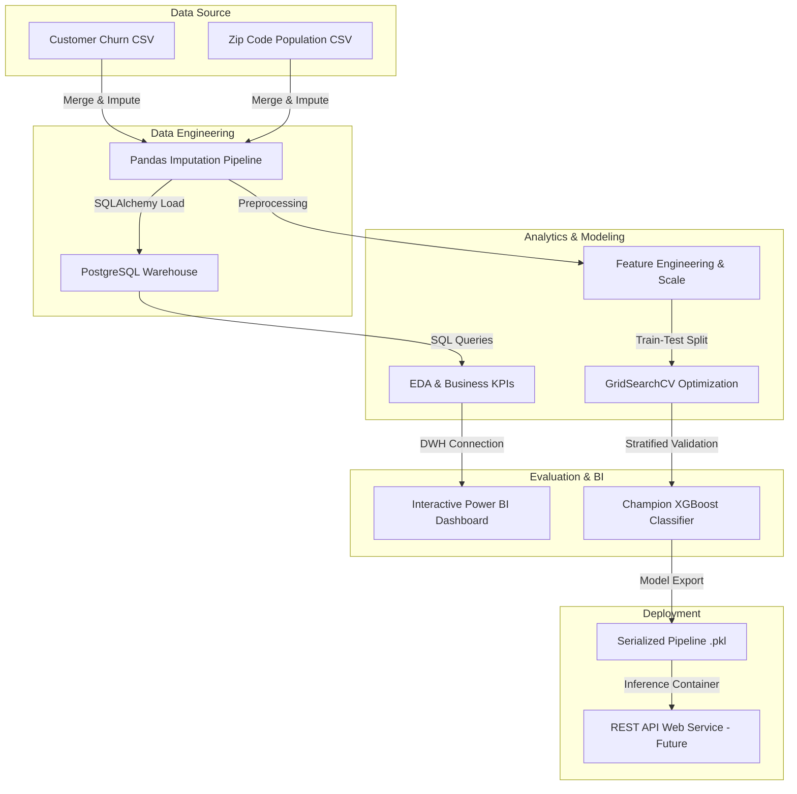
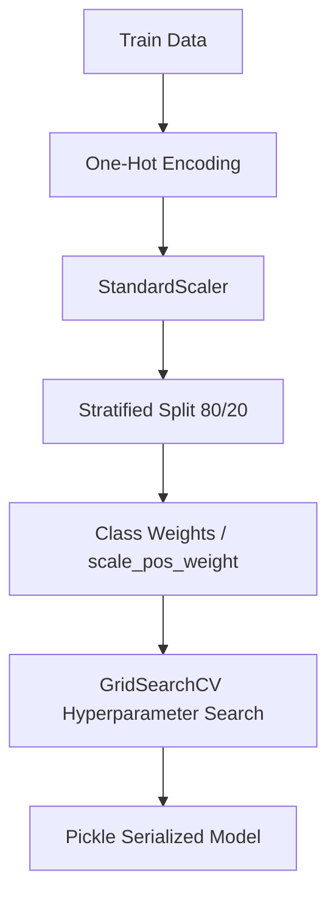

# Telecom Customer Retention Analytics

<p align="center">
  
  
  
  
  
  
</p>

---

## Overview

### Business Problem
Customer churn poses a significant financial threat to telecommunication providers. In our portfolio, customer churn accounts for a **17.24% loss in total revenue** ($3.68M lost out of $21.37M total revenue), with competitive pressure and customer service dissatisfaction acting as primary drivers.

### Project Goal
To build a production-grade analytics and predictive machine learning pipeline that identifies high-risk churn segments, maps service/demographic correlations, and flags individual customers likely to churn before they leave.

### Expected Business Impact
By deploying a high-recall XGBoost model, the company can target at-risk customers with proactive contract migrations and service bundle promotions, potentially recovering up to **$3.68M in annual revenue leak**.

---

## Project Workflow



---

## Features

* 🛠️ **Imputation Pipeline:** Built a robust, business-rule-compliant data-cleaning pipeline handling structural missing values without leaking info.
* 🗄️ **Data Warehousing:** Standardized schema loading using PostgreSQL to store cleaned relational data.
* 📊 **SQL KPI Library:** Set up an extensive library of analytical SQL queries targeting customer lifetime value, churn buckets, and revenue loss.
* 📈 **Exploratory Analysis:** Structured statistical reviews mapping demographic features (Seniors, married status) and contract terms directly to customer attrition.
* 🧠 **Tuned Classifier:** Built a cross-validated XGBoost model optimized using stratified split structures to maximize prediction recall.
* 🎯 **Explainable AI:** Integrated feature importance metrics to highlight individual churn factors.

---

## Dataset

The project utilizes customer records representing active, stayed, and churned portfolios:
* **Total Records:** 7,043 rows
* **Total Columns:** 39 columns (consolidated demographic, billing, and geographic features)
* **Target Variable:** `customer_status` (`Stayed`, `Churned`, `Joined`)
  * *Note:* For predictive modeling, customers who newly `Joined` (454 rows) are filtered out, leaving a modeling subset of **6,589 customers** with an overall churn rate of **28.37%** (binary `churn_label`: `Stayed` = 0, `Churned` = 1).
* **Data Dictionary:** A detailed field specification is available in [telecom_data_dictionary.csv](file:///C:/Users/Swayam B Solanki/Documents/PROJECTS/Telecom Customer Retention Analytics/data/telecom_data_dictionary.csv).

---

## Project Structure

```
├── data/
│   ├── cleaned/
│   │   └── [cleaned_telco_churn.csv](file:///C:/Users/Swayam B Solanki/Documents/PROJECTS/Telecom Customer Retention Analytics/data/cleaned/cleaned_telco_churn.csv)
│   └── raw/
│       ├── [telecom_customer_churn.csv](file:///C:/Users/Swayam B Solanki/Documents/PROJECTS/Telecom Customer Retention Analytics/data/raw/telecom_customer_churn.csv)
│       ├── [telecom_zipcode_population.csv](file:///C:/Users/Swayam B Solanki/Documents/PROJECTS/Telecom Customer Retention Analytics/data/raw/telecom_zipcode_population.csv)
│       └── [telecom_data_dictionary.csv](file:///C:/Users/Swayam B Solanki/Documents/PROJECTS/Telecom Customer Retention Analytics/data/telecom_data_dictionary.csv)
├── docs/
├── images/
│   └── (Contains 25 EDA and visualization plots)
├── notebook/
│   ├── [data_cleaning.ipynb](file:///C:/Users/Swayam B Solanki/Documents/PROJECTS/Telecom Customer Retention Analytics/notebook/data_cleaning.ipynb)
│   ├── [load_to_postgres.ipynb](file:///C:/Users/Swayam B Solanki/Documents/PROJECTS/Telecom Customer Retention Analytics/notebook/load_to_postgres.ipynb)
│   ├── [eda.ipynb](file:///C:/Users/Swayam B Solanki/Documents/PROJECTS/Telecom Customer Retention Analytics/notebook/eda.ipynb)
│   ├── [churn_prediction_model.ipynb](file:///C:/Users/Swayam B Solanki/Documents/PROJECTS/Telecom Customer Retention Analytics/notebook/churn_prediction_model.ipynb)
│   └── [churn_prediction_model_final.ipynb](file:///C:/Users/Swayam B Solanki/Documents/PROJECTS/Telecom Customer Retention Analytics/notebook/churn_prediction_model_final.ipynb)
├── pkl/
│   ├── [churn_scaler.pkl](file:///C:/Users/Swayam B Solanki/Documents/PROJECTS/Telecom Customer Retention Analytics/pkl/churn_scaler.pkl)
│   ├── [churn_xgb_model.pkl](file:///C:/Users/Swayam B Solanki/Documents/PROJECTS/Telecom Customer Retention Analytics/pkl/churn_xgb_model.pkl)
│   └── [churn_model_metadata.json](file:///C:/Users/Swayam B Solanki/Documents/PROJECTS/Telecom Customer Retention Analytics/pkl/churn_model_metadata.json)
├── sql/
│   └── [telco_churn.sql](file:///C:/Users/Swayam B Solanki/Documents/PROJECTS/Telecom Customer Retention Analytics/sql/telco_churn.sql)
└── [.gitignore](file:///C:/Users/Swayam B Solanki/Documents/PROJECTS/Telecom Customer Retention Analytics/.gitignore)
```

---

## Technologies Used

| Technology | Purpose |
| :--- | :--- |
| **Python** | Primary development language |
| **Pandas / NumPy** | Data ingestion, preprocessing, and manipulation |
| **Matplotlib / Seaborn** | Exploratory visualizations and correlation plots |
| **PostgreSQL** | Relational data warehousing for clean telemetry |
| **Scikit-learn** | Pipeline structures, scaling, and evaluation metrics |
| **XGBoost** | High-performance gradient-boosting model training |
| **SHAP** | Model explainability (SHapley Additive exPlanations) |
| **Power BI** | Visual business reporting and executive KPIs |
| **Git / GitHub** | Version control and portfolio hosting |

---

## Exploratory Data Analysis

### Major Analyses Performed
1. **Contract type vs. Churn:** Identified Month-to-Month contracts as a high-risk factor (51.69% churn rate) compared to Two-Year contracts (2.58% churn rate).
2. **Internet Type vs. Churn:** Discovered that premium Fiber Optic subscribers exhibit a surprisingly high churn rate of 42.13%, signaling potential competitive pressure or service quality issues.
3. **Billing Options vs. Churn:** Verified that automated Credit Card billing reduces churn risk compared to Mailed Check options.
4. **Demographics vs. Churn:** Verified that senior citizens (60+) have higher attrition rates (33.83% churn rate) while family structures (dependents) promote customer retention.

<p align="center">
  
  
</p>
<p align="center">
  
</p>

---

## Machine Learning Pipeline



* **Preprocessing:** Binned `tenure_in_months` into logical groupings and engineered spending ratios (`revenue_per_month`, `refund_ratio`).
* **Scaling & Encoding:** Staged dummy encoding for categorical features and applied standard scaling to numeric attributes.
* **Tuning:** Handled class imbalance using target weighting and optimized models using grid search with cross-validation.
* **Explainability:** Leveraged SHAP values to extract local and global explanations for individual predictions.

---

## Model Performance

The tuned XGBoost model outperformed regularized Logistic Regression baseline across all key metrics:

| Model Version | CV ROC-AUC | Test ROC-AUC | Accuracy | Precision (Class 1) | Recall (Class 1) | F1-Score (Class 1) |
| :--- | :---: | :---: | :---: | :---: | :---: | :---: |
| **Model v1: Logistic Regression** | 0.9171 | 0.9094 | 81.03% | 62.40% | **83.42%** | 0.7139 |
| **Model v1: XGBoost Champion** | **0.9384** | **0.9281** | **84.14%** | **68.62%** | 81.28% | **0.7442** |
| *Model v2: Production Model* | *[TBD]* | *[TBD]* | *[TBD]* | *[TBD]* | *[TBD]* | *[TBD]* |

> [!NOTE]
> The champion XGBoost model successfully identifies **81.28% of churners** while maintaining a high precision rate to prevent unnecessary budget waste in marketing campaigns.

---

## Power BI Dashboard

The interactive Power BI dashboard serves as an executive cockpit, connected directly to our PostgreSQL DWH schema.

### Dashboard Key Focus Areas:
* **Executive Overview:** High-level KPIs covering total revenue, active base size, lost revenue, and overall churn rate.
* **Customer Segmentation:** Deep-dives mapping demographic attributes, location profiles, and billing choices.
* **Churn Diagnosis:** Visual breakdowns identifying competitor loss, network problems, and support quality issues.

*[Placeholder: Add dashboard screenshots here once deployed to Power BI Service]*
<!--  -->

---

## Installation

### Prerequisites
Make sure you have [Python 3.10+](https://www.python.org/downloads/) and [PostgreSQL](https://www.postgresql.org/download/) installed on your machine.

### Clone the Repository
```bash
git clone https://github.com/Swayam-Solanki/Telecom-Customer-Retention-Analytics.git
cd Telecom-Customer-Retention-Analytics
```

### Setup Virtual Environment
```bash
python -m venv venv
# On Windows
venv\Scripts\activate
# On macOS/Linux
source venv/bin/activate
```

### Install Requirements
```bash
pip install -r requirements.txt
```
*(Note: If a requirements.txt is not yet generated, you can run `pip install pandas numpy scikit-learn xgboost matplotlib seaborn sqlalchemy psycopg2 joblib`)*

---

## Usage

1. **Clean Data:** Run [notebook/data_cleaning.ipynb](file:///C:/Users/Swayam B Solanki/Documents/PROJECTS/Telecom Customer Retention Analytics/notebook/data_cleaning.ipynb) to merge and impute structural null values.
2. **Load to Warehouse:** Start your local PostgreSQL server, create a database named `telecom_churn_db`, and run [notebook/load_to_postgres.ipynb](file:///C:/Users/Swayam B Solanki/Documents/PROJECTS/Telecom Customer Retention Analytics/notebook/load_to_postgres.ipynb) to populate the schema.
3. **Execute SQL Analytics:** Run the analytical queries stored in [sql/telco_churn.sql](file:///C:/Users/Swayam B Solanki/Documents/PROJECTS/Telecom Customer Retention Analytics/sql/telco_churn.sql) to review portfolio KPIs.
4. **Train Predictive Model:** Execute [notebook/churn_prediction_model_final.ipynb](file:///C:/Users/Swayam B Solanki/Documents/PROJECTS/Telecom Customer Retention Analytics/notebook/churn_prediction_model_final.ipynb) to tune hyperparameters and save the serialized model pipeline (`.pkl`) in the `pkl/` folder.

---

## Future Improvements

* 🚀 **Production REST API:** Build a FastAPI interface wrapper to generate live customer risk predictions.
* 🐳 **Dockerization:** Containerize the pipeline and REST API to simplify deployment to cloud platforms (e.g., AWS Elastic Beanstalk).
* 🔄 **Continuous Integration (CI/CD):** Introduce GitHub Actions workflows to validate data schemas and run unit tests on model performance.
* 🖥️ **Streamlit GUI:** Build a visual web application for customer service agents to check individual customer churn factors interactively.
* 🛡️ **Model Monitoring:** Implement model drift metrics tracking (such as population stability index) to alert when retraining is necessary.

---

## Acknowledgements

* **Dataset:** Open-source telecom demographics and population density resources.
* **Libraries:** PyData stack ecosystem (`pandas`, `scipy`, `scikit-learn`, `xgboost`, `shap`).
* **Open-Source Tools:** Mermaid.js, Shields.io, and the GitHub community.

---

## Contact

Swayam B Solanki - [Swayam-Solanki](https://github.com/Swayam-Solanki)

* **LinkedIn:** [placeholder_linkedin](https://linkedin.com)
* **Email:** [placeholder_email@domain.com](mailto:placeholder_email@domain.com)
