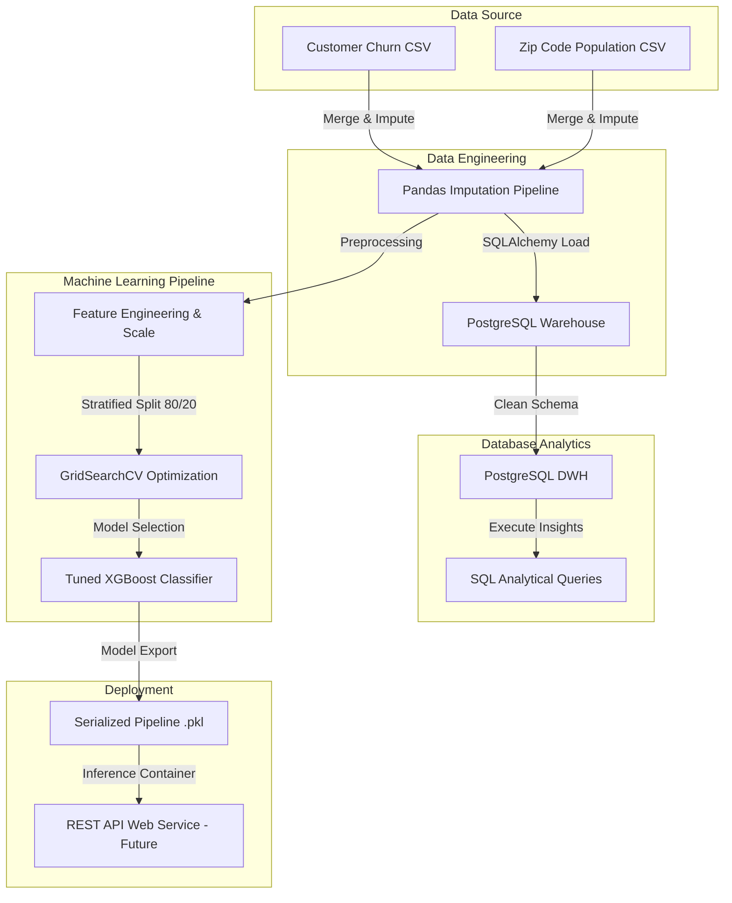
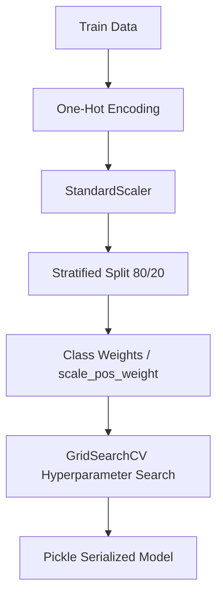

# Telecom Customer Retention Analytics

<p align="center">
  
  
  
  
  
  
</p>

---

## Overview

### Business Problem
Customer churn poses a significant financial threat to telecommunication providers. In our portfolio, customer churn accounts for a **17.24% loss in total revenue** ($3.68M lost out of $21.37M total revenue), with competitive pressure and customer service dissatisfaction acting as primary drivers.

### Project Goal
To build a production-grade analytics and predictive machine learning pipeline that identifies high-risk churn segments, maps service/demographic correlations, and flags individual customers likely to churn before they leave.

### Expected Business Impact
By deploying a high-recall XGBoost model, the company can target at-risk customers with proactive contract migrations and service bundle promotions, potentially recovering up to **$3.68M in annual revenue leak**.

---

## Project Workflow



---

## Features

* 🛠️ **Imputation Pipeline:** Built a robust, business-rule-compliant data-cleaning pipeline handling structural missing values without leaking info.
* 🗄️ **Data Warehousing:** Standardized schema loading using PostgreSQL to store cleaned relational data.
* 🔍 **Deep SQL Analytics:** Created a powerful suite of PostgreSQL queries to extract critical business KPIs, audit revenue loss, and analyze segment vulnerabilities.
* 📈 **Exploratory Analysis:** Structured statistical reviews mapping demographic features (Seniors, married status) and contract terms directly to customer attrition.
* 🧠 **Imbalance-Aware Classifier:** Tuned XGBoost and Logistic Regression classifiers using target class-weighting and cross-validation to maximize churn prediction recall.
* 📦 **Model Serialization:** Exported optimized scalers, model files, and feature metadata for downstream model deployment.

---

## Dataset

The project utilizes customer records representing active, stayed, and churned portfolios:
* **Total Records:** 7,043 rows
* **Total Columns:** 39 columns (consolidated demographic, billing, and geographic features)
* **Target Variable:** `customer_status` (`Stayed`, `Churned`, `Joined`)
  * *Note:* For predictive modeling, customers who newly `Joined` (454 rows) are filtered out, leaving a modeling subset of **6,589 customers** with an overall churn rate of **28.37%** (binary `churn_label`: `Stayed` = 0, `Churned` = 1).
* **Data Dictionary:** A detailed field specification is available in [telecom_data_dictionary.csv](file:///C:/Users/Swayam B Solanki/Documents/PROJECTS/Telecom Customer Retention Analytics/data/telecom_data_dictionary.csv).

---

## Project Structure

```
├── data/
│   ├── cleaned/
│   │   └── [cleaned_telco_churn.csv](file:///C:/Users/Swayam B Solanki/Documents/PROJECTS/Telecom Customer Retention Analytics/data/cleaned/cleaned_telco_churn.csv)
│   └── raw/
│       ├── [telecom_customer_churn.csv](file:///C:/Users/Swayam B Solanki/Documents/PROJECTS/Telecom Customer Retention Analytics/data/raw/telecom_customer_churn.csv)
│       ├── [telecom_zipcode_population.csv](file:///C:/Users/Swayam B Solanki/Documents/PROJECTS/Telecom Customer Retention Analytics/data/raw/telecom_zipcode_population.csv)
│       └── [telecom_data_dictionary.csv](file:///C:/Users/Swayam B Solanki/Documents/PROJECTS/Telecom Customer Retention Analytics/data/telecom_data_dictionary.csv)
├── docs/
├── images/
│   └── (Contains 25 EDA and visualization plots)
├── notebook/
│   ├── [data_cleaning.ipynb](file:///C:/Users/Swayam B Solanki/Documents/PROJECTS/Telecom Customer Retention Analytics/notebook/data_cleaning.ipynb)
│   ├── [load_to_postgres.ipynb](file:///C:/Users/Swayam B Solanki/Documents/PROJECTS/Telecom Customer Retention Analytics/notebook/load_to_postgres.ipynb)
│   ├── [eda.ipynb](file:///C:/Users/Swayam B Solanki/Documents/PROJECTS/Telecom Customer Retention Analytics/notebook/eda.ipynb)
│   ├── [churn_prediction_model.ipynb](file:///C:/Users/Swayam B Solanki/Documents/PROJECTS/Telecom Customer Retention Analytics/notebook/churn_prediction_model.ipynb)
│   └── [churn_prediction_model_final.ipynb](file:///C:/Users/Swayam B Solanki/Documents/PROJECTS/Telecom Customer Retention Analytics/notebook/churn_prediction_model_final.ipynb)
├── pkl/
│   ├── [churn_scaler.pkl](file:///C:/Users/Swayam B Solanki/Documents/PROJECTS/Telecom Customer Retention Analytics/pkl/churn_scaler.pkl)
│   ├── [churn_xgb_model.pkl](file:///C:/Users/Swayam B Solanki/Documents/PROJECTS/Telecom Customer Retention Analytics/pkl/churn_xgb_model.pkl)
│   └── [churn_model_metadata.json](file:///C:/Users/Swayam B Solanki/Documents/PROJECTS/Telecom Customer Retention Analytics/pkl/churn_model_metadata.json)
├── sql/
│   └── [telco_churn.sql](file:///C:/Users/Swayam B Solanki/Documents/PROJECTS/Telecom Customer Retention Analytics/sql/telco_churn.sql)
└── [.gitignore](file:///C:/Users/Swayam B Solanki/Documents/PROJECTS/Telecom Customer Retention Analytics/.gitignore)
```

---

## Technologies Used

| Technology | Purpose |
| :--- | :--- |
| **Python** | Primary development language |
| **Pandas / NumPy** | Data ingestion, preprocessing, and manipulation |
| **Matplotlib / Seaborn** | Exploratory visualizations and correlation plots |
| **PostgreSQL** | Relational data warehousing for clean telemetry |
| **Scikit-learn** | Pipeline structures, scaling, and evaluation metrics |
| **XGBoost** | High-performance gradient-boosting model training |
| **SQL** | Database query design for cohort and revenue analytics |
| **Git / GitHub** | Version control and portfolio hosting |

---

## SQL Database Analytics & Insights

A key pillar of this project is the integration of PostgreSQL to model data and extract deep segment insights. Running the queries in [telco_churn.sql](file:///C:/Users/Swayam B Solanki/Documents/PROJECTS/Telecom Customer Retention Analytics/sql/telco_churn.sql) reveals the critical drivers of churn and financial leaks:

### 1. The Financial Leak (Revenue At Risk)
* **Total Revenue Loss:** **$3,684,459.82** has been lost to churned customers, representing **17.24%** of the portfolio's total generated revenue ($21.37M).
* **Average Customer Value:** Churned customers contributed an average of **$1,971.35** in lifetime revenue before leaving, showing that the company is losing mature, high-value accounts.

### 2. High-Risk Segment Cohorts
* **Contract Duration Risk:** 
  * Customers on **Month-to-Month** contracts exhibit a staggering **51.69% churn rate** (1,655 churned out of 3,202). 
  * Long-term contracts represent extreme stability: **One-Year** contracts have a **10.88%** churn rate, and **Two-Year** contracts drop to an outstanding **2.58%**.
* **Internet Connection Vulnerabilities:**
  * Customers with **Fiber Optic** internet churn at a rate of **42.13%** (1,236 churned out of 2,934), making up **66.1% of all churned customers**. This premium service segment is our highest revenue driver but also our largest churn leak.
  * In contrast, DSL users churn at **19.97%**, and non-internet users churn at only **8.41%**.

### 3. Payment Method Friction
* **Manual vs. Automated Billing:**
  * Customers using manual **Mailed Check** payment methods have a **41.40%** churn rate.
  * Customers using **Bank Withdrawal (E-Check/Direct Debit)** have a **35.65%** churn rate.
  * **Credit Card Auto-Pay** is the safest channel, with a churn rate of only **15.81%**.

### 4. Competitive Analysis (Root Causes of Churn)
SQL categorization of churn reasons points directly to competitor actions:
* **Competitor Offers & Devices:** **841 customers** (45.0% of total churners) left because competitors offered better devices (313), better offers (311), more data (117), or higher download speeds (100).
* **Support Personnel Attitude:** Support and staff attitude issues accounted for **314 churned customers**, leading to over $560K in lost revenue.

---

## Exploratory Data Analysis

Complementing the database metrics, exploratory plots were generated in [eda.ipynb](file:///C:/Users/Swayam B Solanki/Documents/PROJECTS/Telecom Customer Retention Analytics/notebook/eda.ipynb) to inspect multi-variable distributions and correlations:

* **Demographics:** Senior citizens (60+) experience a **33.83%** churn rate compared to younger demographics (under 24) at **21.94%**. Additionally, customers with dependents are far more loyal (only **6.4%** churn rate vs. **32.8%** for those without dependents).
* **Tenure and Referrals:** Tenure shows a strong negative correlation (-0.43) with churn. Customers who make referrals also exhibit significantly lower churn rates.

<p align="center">
  
  
</p>
<p align="center">
  
</p>

---

## Machine Learning Pipeline

The predictive modeling pipeline is fully detailed in [churn_prediction_model_final.ipynb](file:///C:/Users/Swayam B Solanki/Documents/PROJECTS/Telecom Customer Retention Analytics/notebook/churn_prediction_model_final.ipynb):



* **Preprocessing:** Binned `tenure_in_months` into logical groupings and engineered spending ratios (`revenue_per_month`, `refund_ratio`).
* **Feature Drop:** Dropped administrative and high-cardinality features to prevent overfitting: `customer_status`, `churn_category`, `churn_reason`, `customer_i_d`, `zip_code`, `latitude`, `longitude`, and `city`.
* **Scaling & Encoding:** Staged dummy encoding for categorical features and applied standard scaling to numeric attributes.
* **Tuning:** Handled class imbalance using target weighting (`class_weight='balanced'` in Logistic Regression and `scale_pos_weight=2.53` in XGBoost).
* **Optimization:** Fine-tuned parameters using GridSearchCV with 5-fold Stratified Cross-Validation on the training subset.

---

## Model Performance

The tuned XGBoost model outperformed regularized Logistic Regression baseline across all key metrics:

### Test Set Performance Metrics:

| Model Version | CV ROC-AUC | Test ROC-AUC | Accuracy | Precision (Class 1) | Recall (Class 1) | F1-Score (Class 1) |
| :--- | :---: | :---: | :---: | :---: | :---: | :---: |
| **Model v1: Logistic Regression** | 0.9171 | 0.9094 | 81.03% | 62.40% | **83.42%** | 0.7139 |
| **Model v1: XGBoost Champion** | **0.9384** | **0.9281** | **84.14%** | **68.62%** | 81.28% | **0.7442** |

> [!NOTE]
> The champion XGBoost model successfully identifies **81.28% of churners** while maintaining a high precision rate to prevent unnecessary budget waste in marketing campaigns.

---

## Installation

### Prerequisites
Make sure you have [Python 3.10+](https://www.python.org/downloads/) and [PostgreSQL](https://www.postgresql.org/download/) installed on your machine.

### Clone the Repository
```bash
git clone https://github.com/Swayam-Solanki/Telecom-Customer-Retention-Analytics.git
cd Telecom-Customer-Retention-Analytics
```

### Setup Virtual Environment
```bash
python -m venv venv
# On Windows
venv\Scripts\activate
# On macOS/Linux
source venv/bin/activate
```

### Install Requirements
```bash
pip install -r requirements.txt
```
*(Note: If requirements.txt is not present, you can install packages manually: `pip install pandas numpy scikit-learn xgboost matplotlib seaborn sqlalchemy psycopg2 joblib`)*

---

## Usage

1. **Clean Data:** Run [notebook/data_cleaning.ipynb](file:///C:/Users/Swayam B Solanki/Documents/PROJECTS/Telecom Customer Retention Analytics/notebook/data_cleaning.ipynb) to merge and impute structural null values.
2. **Load to Warehouse:** Start your local PostgreSQL server, create a database named `telecom_churn_db`, and run [notebook/load_to_postgres.ipynb](file:///C:/Users/Swayam B Solanki/Documents/PROJECTS/Telecom Customer Retention Analytics/notebook/load_to_postgres.ipynb) to populate the schema.
3. **Execute SQL Analytics:** Run the analytical queries stored in [sql/telco_churn.sql](file:///C:/Users/Swayam B Solanki/Documents/PROJECTS/Telecom Customer Retention Analytics/sql/telco_churn.sql) to review portfolio KPIs.
4. **Train Predictive Model:** Execute [notebook/churn_prediction_model_final.ipynb](file:///C:/Users/Swayam B Solanki/Documents/PROJECTS/Telecom Customer Retention Analytics/notebook/churn_prediction_model_final.ipynb) to tune hyperparameters and save the serialized model pipeline (`.pkl`) in the `pkl/` folder.

---

## Future Improvements

* 🚀 **Production REST API:** Build a FastAPI interface wrapper to generate live customer risk predictions.
* 🐳 **Dockerization:** Containerize the pipeline and REST API to simplify deployment to cloud platforms (e.g., AWS Elastic Beanstalk).
* 🔄 **Continuous Integration (CI/CD):** Introduce GitHub Actions workflows to validate data schemas and run unit tests on model performance.
* 🖥️ **Streamlit GUI:** Build a visual web application for customer service agents to check individual customer churn factors interactively.
* 🛡️ **Model Monitoring:** Implement model drift metrics tracking (such as population stability index) to alert when retraining is necessary.

---

## Acknowledgements

* **Dataset:** Open-source telecom demographics and population density resources.
* **Libraries:** PyData stack ecosystem (`pandas`, `numpy`, `scikit-learn`, `xgboost`).
* **Open-Source Tools:** Mermaid.js, Shields.io, and the GitHub community.

---

## Contact

Swayam B Solanki - [Swayam-Solanki](https://github.com/Swayam-Solanki)

* **LinkedIn:** (https://www.linkedin.com/in/swayam-solankiofficial/)
* **Email:** [swayamsolanki2021@gmail.com]
