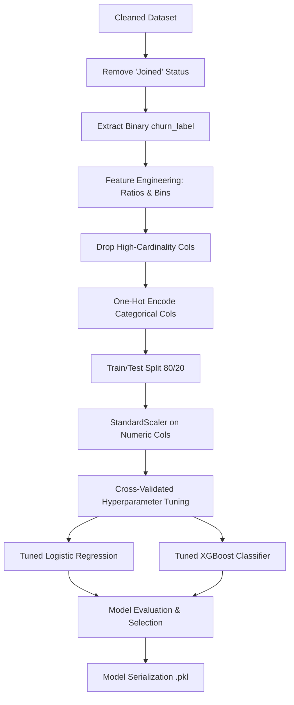
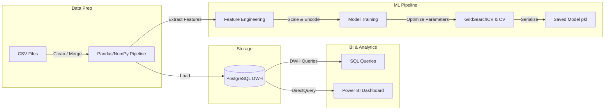

# Telecom Customer Retention Analytics

## 1. Project Overview
This project presents an end-to-end data science and analytics solution designed to understand, predict, and mitigate customer churn for a telecommunications provider. Using a unified data pipeline, the project spans data cleaning, relational database warehousing, exploratory data analysis (EDA), interactive business intelligence dashboarding, and predictive machine learning. 

By analyzing customer demographics, service usage, contract details, and revenue records, this project delivers actionable insights and a high-performance machine learning classifier to identify high-risk customers, allowing the company to deploy proactive retention campaigns and protect its bottom line.

---

## 2. Business Problem
In the highly competitive telecommunications sector, customer acquisition costs (CAC) are significantly higher (often 5 to 25 times) than customer retention costs. Preventing customer churn (attrition) is therefore a primary driver of profitability.

Using the provider's historical records, we analyzed the direct financial impact of churn:
* **Total Portfolio Revenue:** $21,371,131.69
* **Revenue Lost to Churned Customers:** $3,684,459.82 (**17.24%** of total revenue)
* **Overall Customer Count:** 7,043 total customers, of which **1,869** have churned.

### Churn Breakdown by Business Categories:
The top reasons reported for customer attrition show that competitive pressure and customer service attitude are the largest pain points:

| Churn Category | Churned Customers | Key Driver / Reason |
| :--- | :--- | :--- |
| **Competitor** | 841 (45.0%) | Competitor had better devices (313), made better offers (311) |
| **Dissatisfaction** | 321 (17.2%) | Product dissatisfaction (77), network reliability issues (72) |
| **Attitude** | 314 (16.8%) | Unhelpful attitude of support staff (220) or service provider (94) |
| **Price** | 211 (11.3%) | High monthly charges (78), long-distance fees (64) |
| **Other** | 182 (9.7%) | Customer relocated (46), deceased (6), or unknown (130) |

---

## 3. Objectives
The key objectives of this project are:
1. **Consolidate and Clean Data:** Merge disparate customer and population datasets, resolve structural missing values, and validate schema integrity.
2. **Perform Exploratory Analysis:** Establish key performance indicators (KPIs) and identify demographic, financial, and behavioral drivers of churn.
3. **Build a Production-Grade ML Pipeline:** Develop and fine-tune a binary classification model to predict churn risk with high sensitivity (Recall).
4. **Deliver Business Intelligence:** Create database schemas and extract SQL queries to feed interactive reports (e.g., Power BI) for executive decision-making.
5. **Formulate Retention Strategies:** Provide concrete, data-supported recommendations to reduce revenue leakage.

---

## 4. Dataset Description
The analysis is based on a customer dataset from a California-based telecom company. It consists of the following components:

### Raw Datasets
* **`telecom_customer_churn.csv`** (7,043 rows, 38 columns): Contains customer demographics (gender, age, marital status, dependents), locations (city, zip code), services (phone, internet, streaming, unlimited data), contracts, account details (tenure, charges, refunds, revenue), and status.
* **`telecom_zipcode_population.csv`** (1,671 rows, 2 columns): Mapping of Zip Codes to population density.
* **`telecom_data_dictionary.csv`**: Meta-information explaining fields and accepted values.

### Cleaned Dataset
* **`cleaned_telco_churn.csv`**: Consolidated dataset produced by a left-join of the customer and population files on the `zip_code` column. Structural missingness is handled, and data types are optimized.

### Target Variable
The target variable for analysis is the customer's status:
* **Stayed:** Customers who remain active.
* **Churned:** Customers who left the company during the quarter.
* **Joined:** Newly acquired customers (tenure $\le 3$ months) who have not yet had the opportunity to churn.
* **For Predictive Modeling:** Customers with a status of `Joined` (454 records) are excluded because their retention outcome is not yet determined. The target is converted into a binary label (`churn_label`): `Stayed` (0) and `Churned` (1), yielding a modeling subset of 6,589 customers with a **28.37%** churn rate.

---

## 5. Data Cleaning Summary
To prepare the dataset for analysis and modeling, a rigorous data cleaning pipeline was implemented in [data_cleaning.ipynb](file:///C:/Users/Swayam%20B%20Solanki/Documents/PROJECTS/Telecom%20Customer%20Retention%20Analytics/notebook/data_cleaning.ipynb):

1. **Dataset Merging:** Merged demographics with zipcode populations using `Zip Code`.
2. **Structural Null Imputation:** Imputed missing values based on business logic to prevent data leakage and representation errors:
   * **Phone Services:** Customers without `Phone Service` had missing values for `Multiple Lines` and `Avg Monthly Long Distance Charges`. These were imputed with `"No"` and `0` respectively.
   * **Internet Services:** Customers without `Internet Service` had missing values for internet-dependent columns (`Online Security`, `Online Backup`, `Device Protection Plan`, `Premium Tech Support`, `Streaming TV`, `Streaming Movies`, `Streaming Music`, `Unlimited Data`). These were imputed with `"No"`, and `Avg Monthly GB Download` was set to `0`.
   * **Marketing Offers:** Missing values in the accepted `Offer` column were replaced with `"none"`.
3. **Target Imputation:** Missing values in `Churn Category` and `Churn Reason` for active customers were filled with `"not_churned"`.
4. **Data Type Correction:** Converted `Zip Code` from integer to string since it is a categorical identifier.
5. **Consistency Checks:** Checked and stripped leading/trailing spaces across all text variables. Confirmed there were **no duplicate records**.

---

## 6. Exploratory Data Analysis Summary

### Key Findings
* **Contract Duration:** Month-to-month contracts exhibit a massive **51.69%** churn rate (1,655 churned vs. 1,547 stayed). Conversely, two-year contracts show an exceptional retention rate, with a churn rate of only **2.58%** (48 churned vs. 1,813 stayed).
* **Internet Type:** Premium Fiber Optic customers have a very high churn rate of **42.13%** (1,236 churned vs. 1,698 stayed). In contrast, DSL customers churn at **19.97%**, and customers with no internet service churn at only **8.41%**.
* **Payment Methods:** Customers paying via Mailed Check (**41.40%** churn rate) and Bank Withdrawal (**35.65%**) churn at much higher rates than those using Credit Cards (**15.81%**).
* **Demographics:** Age is a major differentiator. Senior citizens (60+) experience a **33.83%** churn rate compared to younger demographics (under 24) at **21.94%**. Additionally, customers with dependents are far more loyal (only **6.4%** churn rate vs. **32.8%** for those without dependents).
* **Tenure and Referrals:** Tenure shows a strong negative correlation (-0.43) with churn. Customers who make referrals also exhibit significantly lower churn rates.

### Business Insights
1. **The Fiber Optic Paradox:** While fiber optic internet is our highest-revenue and fastest service, it suffers from severe customer attrition. This is driven by competitors offering better devices/data plans and network stability/support dissatisfaction.
2. **Month-to-Month Exposure:** Over 88% of all churned customers were on Month-to-Month contracts. This segment is highly volatile and represents a severe vulnerability.
3. **Digital Auto-Pay Advantage:** Automated billing via Credit Cards significantly reduces churn. Manual check payments are associated with low customer engagement and high attrition.

---

## 7. Feature Engineering & Preprocessing
To maximize the predictive power of our machine learning models, the following transformations were performed:

* **Feature Engineering:**
  * **`revenue_per_month`:** Created by dividing `total_revenue` by `tenure_in_months` to capture the customer's average monthly spend.
  * **`refund_ratio`:** Developed by dividing `total_refunds` by `total_charges` to quantify customer billing dissatisfaction.
  * **`tenure_group`:** Categorized `tenure_in_months` into bins (`0-12mo`, `12-24mo`, `24-48mo`, `48mo+`).
* **Feature Drop:** Dropped administrative and high-cardinality features to prevent overfitting: `customer_status`, `churn_category`, `churn_reason`, `customer_i_d`, `zip_code`, `latitude`, `longitude`, and `city`.
* **Encoding:** Transformed all categorical features using one-hot encoding (`pd.get_dummies(..., drop_first=True)`).
* **Feature Scaling:** Applied `StandardScaler` to all continuous numeric features (`age`, `tenure_in_months`, `monthly_charge`, etc.) to standardize input scales for linear models.

---

## 8. Machine Learning Pipeline



### Data Preparation
The dataset was split into an **80% training set (5,271 records)** and a **20% test set (1,318 records)**, stratified on the target `churn_label` to maintain the ~28.4% churn distribution.

### Model Selection
Two primary algorithms were evaluated:
1. **Logistic Regression (L1/L2 Regularized):** Serving as a fast, interpretable baseline.
2. **XGBoost Classifier:** A gradient-boosted tree ensemble suited for tabular data with complex, non-linear feature interactions.

### Training & Fine-Tuning
Hyperparameter optimization was conducted via grid search using **5-fold Stratified Cross-Validation**:
* **Logistic Regression Tuning:** Regularization strength `C` and penalty (`l1`, `l2`).
* **XGBoost Tuning:** Number of estimators, maximum tree depth, learning rate, and subsample ratios.
* **Imbalance Handling:** 
  * Logistic Regression used `class_weight='balanced'`.
  * XGBoost applied `scale_pos_weight = 2.53` (the ratio of negative to positive training classes).

### Evaluation Strategy
Because the primary business goal is to prevent customer loss, the evaluation focused on **Recall** (capturing as many actual churners as possible) and **ROC-AUC** (overall model discrimination capability), while keeping **Precision** at a level that avoids excessive spending on retention marketing for customers who intend to stay.

---

## 9. Model Performance

The tuned XGBoost model outperformed the regularized Logistic Regression across almost all classification metrics:

### Test Set Performance Metrics:

| Model | CV ROC-AUC | Test ROC-AUC | Test Accuracy | Test Precision (Class 1) | Test Recall (Class 1) | Test F1-Score (Class 1) |
| :--- | :---: | :---: | :---: | :---: | :---: | :---: |
| **Logistic Regression** | 0.9171 | 0.9094 | 81.03% | 62.40% | **83.42%** | 0.7139 |
| **XGBoost Classifier** | **0.9384** | **0.9281** | **84.14%** | **68.62%** | 81.28% | **0.7442** |

### Confusion Matrices (Test Set):

* **Logistic Regression:**
  * **True Negatives (Predicted Stayed, Actual Stayed):** 756
  * **False Positives (Predicted Churned, Actual Stayed):** 188
  * **False Negatives (Predicted Stayed, Actual Churned):** 62
  * **True Positives (Predicted Churned, Actual Churned):** 312

* **XGBoost Classifier:**
  * **True Negatives (Predicted Stayed, Actual Stayed):** 805
  * **False Positives (Predicted Churned, Actual Stayed):** 139
  * **False Negatives (Predicted Stayed, Actual Churned):** 70
  * **True Positives (Predicted Churned, Actual Churned):** 304

> [!NOTE]
> XGBoost was chosen as the champion model. It correctly flags **81.28% of churners** while making 26% fewer false-positive errors than Logistic Regression, saving retention marketing budget.

---

### *[Placeholder: Dashboard Visualizations & Metrics for Model v2]*
*(This section is reserved for future model performance runs or screenshots of interactive performance monitoring reports.)*

---

## 10. Feature Importance & Explainability
Feature importances extracted from the champion XGBoost model highlight the structural, behavioral, and financial drivers of customer churn:

### Top 15 Feature Importances (XGBoost):
1. **`internet_type_Fiber Optic`** (0.1796): Premium internet type is the most critical feature.
2. **`contract_Two Year`** (0.1672): Strong indicator of long-term customer lock-in.
3. **`contract_One Year`** (0.1042): Mid-term contract commitment.
4. **`tenure_in_months`** (0.0791): Represents relationship length.
5. **`streaming_movies_Yes`** (0.0544): Customer engagement with media features.
6. **`number_of_dependents`** (0.0484): Indicates household stability.
7. **`number_of_referrals`** (0.0468): Level of customer advocacy and organic engagement.
8. **`payment_method_Credit Card`** (0.0308): Autopay convenience reduces friction.
9. **`married_Yes`** (0.0254): Relates to family household structures.
10. **`monthly_charge`** (0.0250): Captures price sensitivity.
11. **`avg_monthly_g_b_download`** (0.0225): Internet usage metrics.
12. **`online_security_Yes`** (0.0204): Subscribing to value-added security services.
13. **`streaming_music_Yes`** (0.0180): Media bundle engagement.
14. **`age`** (0.0140): Demographic age groups.
15. **`paperless_billing_Yes`** (0.0137): Billing preferences.

### Explainability Insights:
* **Contract Length & Tenure:** Short tenure combined with Month-to-Month contracts is a strong predictor of churn. Migrating customers to long-term contracts acts as a protective shield against competitor outreach.
* **The Fiber Optic Risk:** Subscribing to Fiber Optic services increases churn risk. Since these customers pay premium rates, they are highly sensitive to service quality issues and aggressive competitor promotions.
* **Frictionless Autopay:** Credit card billing shows a strong association with lower churn, indicating that friction in bill payment (e.g., mailed checks) triggers periodic churn evaluation.

---

## 11. Business Recommendations

Based on SQL and EDA insights, we recommend the following strategic actions:

1. **Incentivize Contract Migrations:**
   * **Target:** Month-to-Month customers.
   * **Action:** Offer targeted discounts (e.g., $5-10 off monthly for 12 months) or service upgrades (e.g., free Online Security for a year) to transition them to 1-year or 2-year contracts. Month-to-Month customers exhibit a **51.69%** churn rate, whereas 2-year contracts reduce this to **2.58%**.
2. **Address Fiber Optic Quality & Price Concerns:**
   * **Target:** Fiber Optic subscribers (churn rate is a high **42.13%**).
   * **Action:** Audit network reliability in zip codes with high Fiber Optic churn. Package Fiber Optic with value-added services like free Online Security and Premium Tech Support, which are shown to improve retention.
3. **Promote Credit Card Auto-Pay:**
   * **Target:** Customers using Bank Withdrawal or Mailed Check.
   * **Action:** Provide a one-time bill credit (e.g., $10) or a minor monthly discount for switching to credit card-based automatic billing.
4. **Reward Referral Engagement:**
   * **Target:** High-tenure customers who have not referred others.
   * **Action:** Deploy a referral rewards program (e.g., "Refer a friend, get a free month"). Customers with referrals are significantly less likely to churn.
5. **Optimize Customer Service & Support Training:**
   * **Target:** Operational processes.
   * **Action:** Since **Attitude of support/service staff** was responsible for **314 churned customers** ($560K+ in lost revenue), prioritize customer service soft-skills training and optimize technical support response times.

---

## 12. Project Workflow



1. **Ingestion & Integration:** Raw CSV data is merged, formatted, and cleaned in Python using [data_cleaning.ipynb](file:///C:/Users/Swayam%20B%20Solanki/Documents/PROJECTS/Telecom%20Customer%20Retention%20Analytics/notebook/data_cleaning.ipynb).
2. **Data Warehousing:** Cleaned structured data is loaded into PostgreSQL via SQLAlchemy in [load_to_postgres.ipynb](file:///C:/Users/Swayam%20B%20Solanki/Documents/PROJECTS/Telecom%20Customer%20Retention%20Analytics/notebook/load_to_postgres.ipynb).
3. **Exploratory Analysis:** Deep insights and correlations are developed in [eda.ipynb](file:///C:/Users/Swayam%20B%20Solanki/Documents/PROJECTS/Telecom%20Customer%20Retention%20Analytics/notebook/eda.ipynb), while core business KPIs are generated using standard SQL queries in [telco_churn.sql](file:///C:/Users/Swayam%20B%20Solanki/Documents/PROJECTS/Telecom%20Customer%20Retention%20Analytics/sql/telco_churn.sql).
4. **Interactive Dashboarding:** Power BI connects directly to the PostgreSQL database to present live executive-level KPIs, customer geography, and revenue leak metrics.
5. **Machine Learning Development:** Feature engineering, encoding, stratification, and scaling are set up in [churn_prediction_model_final.ipynb](file:///C:/Users/Swayam%20B%20Solanki/Documents/PROJECTS/Telecom%20Customer%20Retention%20Analytics/notebook/churn_prediction_model_final.ipynb). Tuned classifiers are evaluated, and the final model is saved as a serialized pickle file.

---

## 13. Folder Structure

The project directory is structured as follows:

```
├── data/
│   ├── cleaned/
│   │   └── [cleaned_telco_churn.csv](file:///C:/Users/Swayam B Solanki/Documents/PROJECTS/Telecom Customer Retention Analytics/data/cleaned/cleaned_telco_churn.csv)
│   └── raw/
│       ├── [telecom_customer_churn.csv](file:///C:/Users/Swayam B Solanki/Documents/PROJECTS/Telecom Customer Retention Analytics/data/raw/telecom_customer_churn.csv)
│       ├── [telecom_zipcode_population.csv](file:///C:/Users/Swayam B Solanki/Documents/PROJECTS/Telecom Customer Retention Analytics/data/raw/telecom_zipcode_population.csv)
│       └── [telecom_data_dictionary.csv](file:///C:/Users/Swayam B Solanki/Documents/PROJECTS/Telecom Customer Retention Analytics/data/telecom_data_dictionary.csv)
├── docs/
├── images/
│   └── (Contains 25 EDA and visualization plots)
├── notebook/
│   ├── [data_cleaning.ipynb](file:///C:/Users/Swayam B Solanki/Documents/PROJECTS/Telecom Customer Retention Analytics/notebook/data_cleaning.ipynb)
│   ├── [load_to_postgres.ipynb](file:///C:/Users/Swayam B Solanki/Documents/PROJECTS/Telecom Customer Retention Analytics/notebook/load_to_postgres.ipynb)
│   ├── [eda.ipynb](file:///C:/Users/Swayam B Solanki/Documents/PROJECTS/Telecom Customer Retention Analytics/notebook/eda.ipynb)
│   ├── [churn_prediction_model.ipynb](file:///C:/Users/Swayam B Solanki/Documents/PROJECTS/Telecom Customer Retention Analytics/notebook/churn_prediction_model.ipynb)
│   └── [churn_prediction_model_final.ipynb](file:///C:/Users/Swayam B Solanki/Documents/PROJECTS/Telecom Customer Retention Analytics/notebook/churn_prediction_model_final.ipynb)
├── pkl/
│   ├── [churn_scaler.pkl](file:///C:/Users/Swayam B Solanki/Documents/PROJECTS/Telecom Customer Retention Analytics/pkl/churn_scaler.pkl)
│   ├── [churn_xgb_model.pkl](file:///C:/Users/Swayam B Solanki/Documents/PROJECTS/Telecom Customer Retention Analytics/pkl/churn_xgb_model.pkl)
│   └── [churn_model_metadata.json](file:///C:/Users/Swayam B Solanki/Documents/PROJECTS/Telecom Customer Retention Analytics/pkl/churn_model_metadata.json)
├── sql/
│   └── [telco_churn.sql](file:///C:/Users/Swayam B Solanki/Documents/PROJECTS/Telecom Customer Retention Analytics/sql/telco_churn.sql)
├── [.gitignore](file:///C:/Users/Swayam B Solanki/Documents/PROJECTS/Telecom Customer Retention Analytics/.gitignore)
└── [project_documentation.md](file:///C:/Users/Swayam B Solanki/Documents/PROJECTS/Telecom Customer Retention Analytics/project_documentation.md)
```

---

## 14. Future Improvements
* **REST API Deployment:** Build a lightweight FastAPI web service to receive customer data payloads in JSON and return real-time churn probabilities.
* **Feature Expansion:** Integrate external macro-economic indicators or customer sentiment analysis from support call transcript logs to capture customer frustration early.
* **Deep Learning Experimentation:** Test TabNet or feedforward neural networks to see if deep learning models can capture subtle multi-feature interactions better than tree-based ensembles.
* **Automated Pipeline Monitoring (MLOps):** Set up automated retraining pipelines using tools like MLflow to prevent model drift as customer behavior changes over time.

---

## 15. Conclusion
This project demonstrates how data-driven analytics and machine learning can be combined to resolve a critical business problem: customer attrition. By combining Python's powerful modeling capabilities with PostgreSQL's relational storage and SQL's descriptive querying, we identified that **Month-to-Month contracts** and **Fiber Optic connections** represent the company's highest churn vulnerabilities. 

The developed XGBoost champion model successfully identifies **81.28% of churners** on test data with an **AUC-ROC of 92.81%**, providing the business with a reliable mechanism to target retention campaigns, protect **$3.68M in at-risk revenue**, and optimize customer lifetime value.
